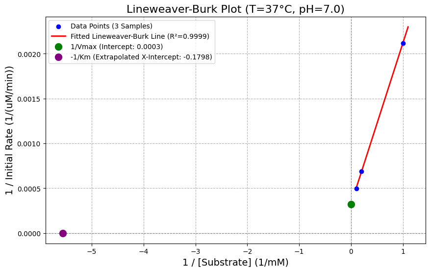

# 🧪 Enzyme Speed Test: Finding Max Power ($V_{\text{max}}$) and Affinity ($K_m$)

This project uses Python and fundamental machine learning concepts to analyze raw enzyme kinetic data. By transforming the data into a linear format (the Lineweaver-Burk plot), we can use simple linear regression to accurately determine key biochemical parameters, such as $K_m$ and $V_{\text{max}}$, with high confidence.

---

## 💻 Tech Stack

The analysis is built entirely using Python and its core scientific libraries:

- 🐍 **Language:** Python  
- 🗂️ **Data Processing:** pandas  
- 🧮 **Modeling & Metrics:** scikit-learn (`LinearRegression`, `r2_score`)  
- 📊 **Visualization:** matplotlib (for plotting the Lineweaver-Burk line)  

---

## 📁 How to See the Code and Results

To view the specific code, calculated output values, and the generated Lineweaver-Burk plot, navigate to the `EnzymePrediction.ipynb` file.

**In this notebook you can see:**

- ✅ **Outputted values** showing a confidence score ($R^2$) of ~0.99, which is near perfect.  
- 📈 **A graph** visually representing the Lineweaver-Burk plot and how the linear regression accurately models the enzyme kinetics, including $V_{\text{max}}$ and $K_m$.

> 💡 **Tip:** The graph helps you visually confirm the slope (Kₘ) and intercept (Vmax) for different substrate concentrations.

---

## 💡 Key Concepts Explained

| 🔬 Term | 📝 Simple Explanation |
|---------|---------------------|
| **Enzyme Kinetics** | How fast enzymes work and how they respond to substrate, temperature, or pH changes. |
| **Lineweaver-Burk Plot** | Turns the curved Michaelis-Menten data into a straight line using reciprocals ($1/[S]$ and $1/v$), making calculations easier. |
| **$V_{\text{max}}$ (Maximum Velocity)** | The fastest rate an enzyme can process substrate when fully saturated. |
| **$K_m$ (Michaelis Constant)** | Measures enzyme-substrate affinity. Lower $K_m$ = higher affinity and efficiency. |
| **$R^2$ Score** | Confidence of the linear model. Close to 1 → excellent fit. |
| **Mean Squared Error (MSE)** | Average squared difference between predicted and actual data points; smaller is better. |

---

## 📊 Example Output for T=37°C, pH=7.0

From the `EnzymePrediction.ipynb` notebook:

- **Confidence Score (R²):** 0.9999 → near perfect fit  
- **Mean Squared Error (MSE):** 0.0000 → regression line matches data perfectly  
- **Vmax:** 3095.21 µM/min → enzyme’s maximum speed  
- **Km:** 5.562 mM → substrate concentration at half-max speed  

### Interpretation:

- The enzyme works **most efficiently at 37°C, pH=7.0**.  
- Low Km indicates moderate substrate affinity.  
- The Lineweaver-Burk plot shows a straight red line through the actual data points (blue), confirming the model fit.

> 💡 **Tip:** Use the y-intercept for Vmax and the x-intercept for Km to compare enzyme performance under different conditions.

---

## 🔬 Interpreting the Results

The output values show enzyme performance under a specific condition (e.g., 37°C, pH 7.0):

- ⚡ **Enzyme Speed & Power ($V_{\text{max}}$)**  
  - Measures the enzyme's ultimate potential.  
  - Higher $V_{\text{max}}$ → optimal condition.  
  - Example: 37°C → 3000 µM/min, 50°C → 500 µM/min.  

- 🎯 **Enzyme Efficiency & Affinity ($K_m$)**  
  - Measures how efficiently the enzyme binds substrate.  
  - Low $K_m$ → high affinity; high $K_m$ → low affinity.  
  - Example: Lower $K_m$ at pH 7.0 than pH 6.0 → enzyme more efficient at pH 7.0.  

- 🛡️ **Model Trustworthiness ($R^2$ Score)**  
  - >0.98 → excellent, fully trust $V_{\text{max}}$ and $K_m$.  
  - >0.90 → good, minor noise may exist.  
  - <0.80 → poor, interpret parameters cautiously.  

---

## 🛠️ Analysis Steps

1. **🔄 Data Transformation (The Reciprocal Step)**  
   - Convert Substrate ($[S]$) and Initial Rate ($v$) to reciprocals ($1/[S]$, $1/v$).  
   - Straightens the Michaelis-Menten curve into a line for regression.

2. **📌 Isolation & Model Training**  
   - Filter data for a single condition (e.g., 37°C, pH 7.0).  
   - Train a `LinearRegression` model: X = $1/[S]$, Y = $1/v$.

3. **📊 Calculation & Metrics**  
   - Compute $R^2$ score as a confidence metric.  
   - Determine kinetic parameters:  
     - $V_{\text{max}} = 1/\text{Intercept}$  
     - $K_m = \text{Slope} \times $V_{\text{max}}$  

4. **📈 Visualization**  
   - Plot Lineweaver-Burk using matplotlib.  
   - Show data points, regression line, and intercepts.  

> 💡 **Tip:** Compare Vmax and Km across different temperatures or pH to determine optimal conditions for the enzyme.

---
